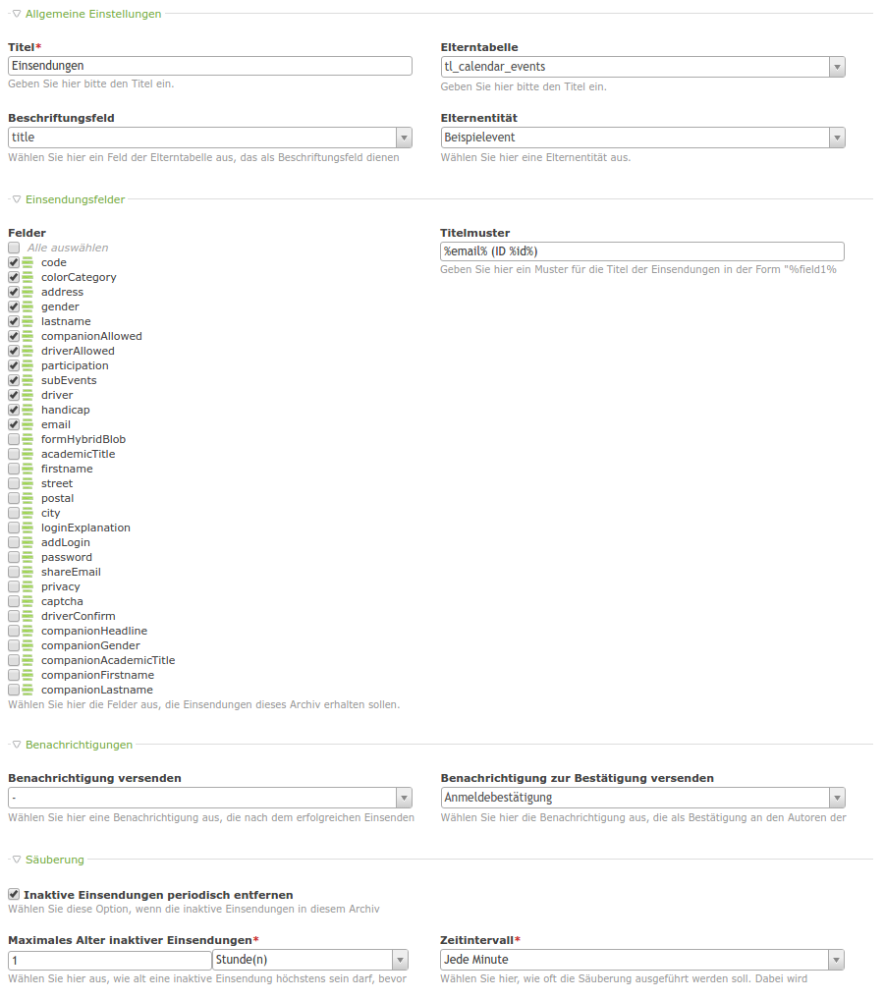
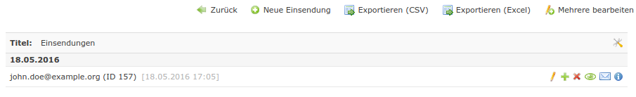
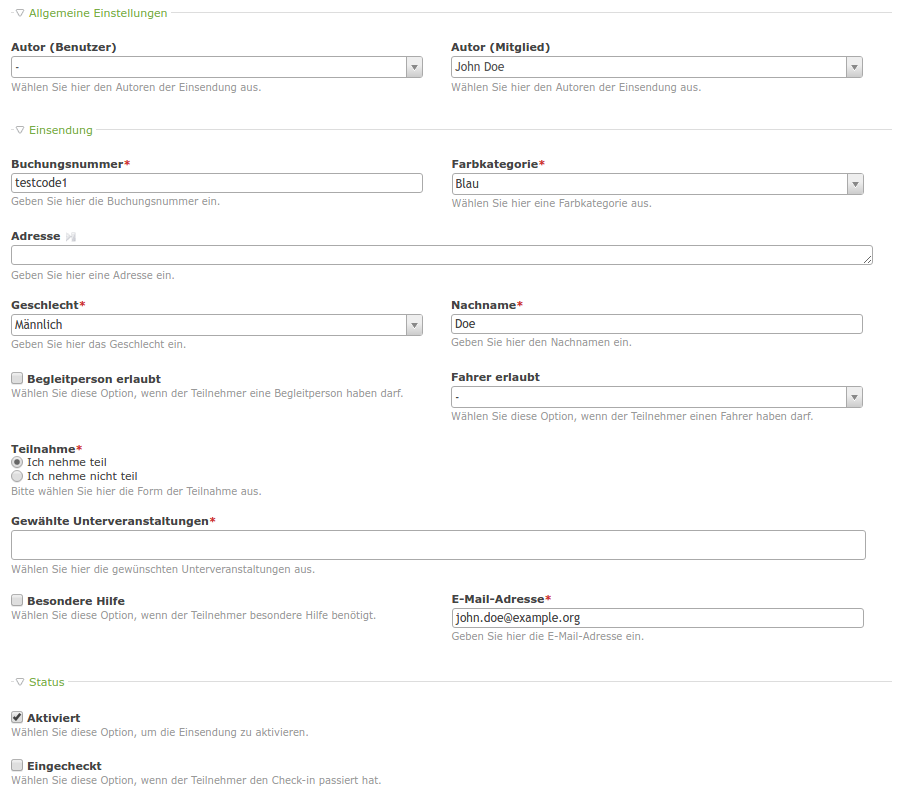

# Submissions

A generic module to store and handle submissions in Contao. You can use it with all of your modules to simplify submission handling.
Works great with [heimrichhannot/frontendedit](https://github.com/heimrichhannot/contao-frontendedit),
[heimrichhannot/formhybrid_list](https://github.com/heimrichhannot/contao-formhybrid_list) and
[heimrichhannot/formhybrid](https://github.com/heimrichhannot/contao-formhybrid).

*Archive configuration*

*List view with opportunity to export and resend confirmation*

*Submission view (every field of this form can be changed, of course)*

## Features

- a new submissions entity (organized in archives)
- opportunity to specify a parent entity for each archive (e.g. an event)
- submissions are highly customizable by defining new fields in your dca (palette is created with no code at all)
- every archive can specify its own submission field list
- rich interfaces (e.g. SubmissionModel)
- handling for notification center messages ([terminal42/contao-notification_center](https://github.com/terminal42/contao-notification_center))
- easily export submissions as CSV and Excel file (using [heimrichhannot/contao-exporter](https://github.com/heimrichhannot/contao-exporter))
- optional cleaner support for periodically removing unpublished (aka inactive) submissions (using TL_CRON or your server's cron, using [heimrichhannot/contao-entity_cleaner](https://github.com/heimrichhannot/contao-entity_cleaner))
- specify a member (frontend) or a user (backend) to be the author of the submission

### Fields

tl_submission:

Name | Description
---- | -----------
userAuthor | Specifies a backend user to be author of the submission
memberAuthor | Specifies a frontend member to be author of the submission
published | Determines whether the submission is published (aka inactive)
formHybridBlob | Can be used in combination with [heimrichhannot/formhybrid](https://github.com/heimrichhannot/contao-formhybrid) to temporarily save submission data to a blob before really saving it to database.

tl_submission_archive:

Name | Description
---- | -----------
parentTable | Specifies the parent table (if necessary)
parentField | Specifies the parent table's label field
pid | Stores the id of the parent entity
title | Specifies the title of the archive
submissionFields | Specifies the fields visible in the forms of submissions of the current archive
titlePattern | Specifies a pattern for the archive's submission's label (e.g. "%title% %someotherfield%")
nc_submission | Specifies a notification being sent when submitting a submission (sorry for the poor expression ^^). Could be used for informing some customer that a submission had been made.
nc_confirmation | Specifies a notification being sent to the author of the submission. Can be resent in the list view of the archive via backend.

### Hooks

Name | Arguments | Description
---- | --------- | -----------
preGenerateSubmissionTokens | $objSubmission, $objSubmissionArchive, $arrFields | Triggered just before the token generation for notifications is started. Could be used for changing the field list.